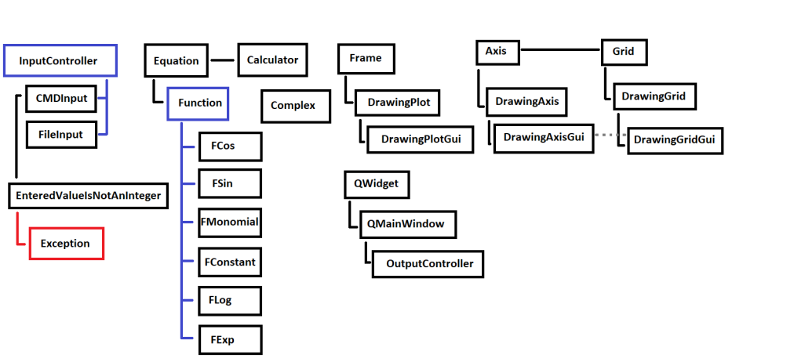

## 1. Temat

Celem projektu jest zapewnienie użytkownikowi możliwości wizualizacji parametrycznych na płaszczyźnie.
Pierwsze wersja jest konsolowa i zakłada stosunkowo małą dowolność dla użytkownika narzucając mu 4 szkielety funkcji.
Mimo tego efekty, które może dzięki nim osiągnąć są bardzo rozmaite i efektowne.
Kolejne wersje zakładają przede wszystkim tryb graficzny oraz większą dowolność w wyborze funkcji.

## 2. Zespół

- Górski Adam      204
- Kusiak Andrzej   204
- Bondaruk Łukasz  208

## 3. Podział zadań

- Kontrola wejścia - A.K
- Kontrola wyjścia - A.G
- Funkjce, Kalkulator punktów - Ł.B

- Złączenie programu w całość
- Rozmowa z użytkownikiem

## 4. Sposób użycia

Użytkownik podaje kolejnow konsoli:
- liczbe punktów
- lewą i prawą granicę równania
- liczbe funkcji dla x
- rodzaje funkcjii i ich parametry
- liczbe funkcji dla y
- rodzaje funkcjii i ich parametry

## 5. Przygotowanie środowiska do testowania interfejsu graficznego

Jak skonfigurować QT z visual studio:

1. Potrzeba jest dystrybucja QT 5.0+ (korzystaliśmy z 5.9.9, w ramach dystrybucji musi być zainstalowane narzędzie msvc2017_x64, albo nowsze) - potrzebne pliki mogą mieć około 12GB-
korzystaliśmy z wersji Open Source

2. Potrzebna jest wtyczka Qt visual studio tools (https://marketplace.visualstudio.com/items?itemName=TheQtCompany.QtVisualStudioTools2019)

3. W ustawieniach wtyczki trzeba dodać scieżkę (extensions/qt/qt_options/add i ścieżka powinna prowadzić do msvc

4. Przebudować rozwiązanie (rebuild solution)

5. W przypadku problemów z konsolą trzeba ustawić w ustawieniach projektu zamiast windows zamienić na console (często po instalacji wtyczki może to zostać zmienione).

## 6. Hierarchia klas
